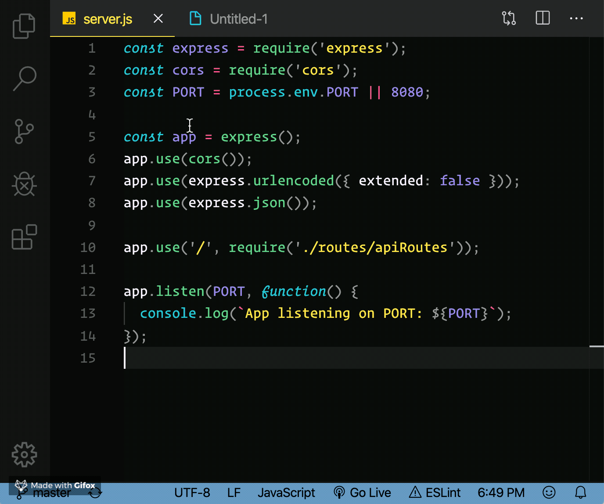

# VS Code Markdown extension
Copy your code / text as markdown format from within Visual Studio Code.

#### How it works?
* Copy selection as markdown

### Installation
You can install this extension by pressing F1 in Visual Studio Code, then typing "ex install" and selecting it from the list.

### Configuration
No config changes needed for this extension.

### Feedback / Bug report / feature request
https://github.com/alperg/markdown-vscode/issues

### Credits
Extension icon made by [Freepik](https://www.flaticon.com/authors/freepik/ "Freepik") from [flaticon.com](https://www.flaticon.com/ "Flaticon")
